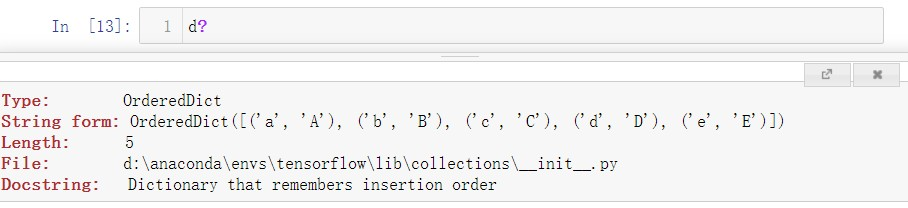
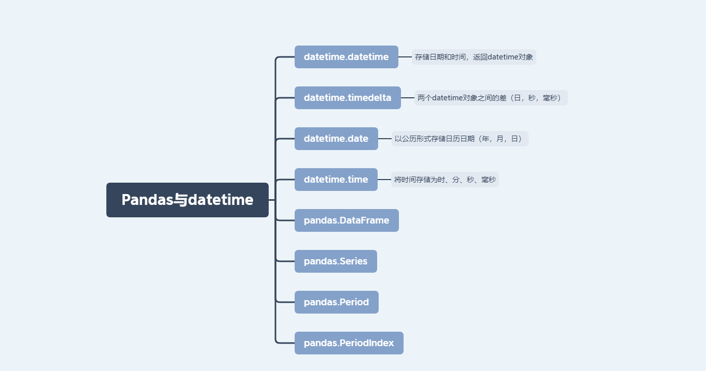
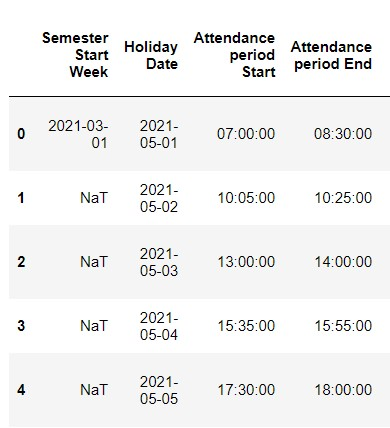

# 重要的Python库

## NumPy
- Python科学计算基础包。

## Pandas
- 提供了能够快速便捷地处理结构化数据的大量数据结构和函数。

## matplotlib
- 用于绘制图表的Python库。

## IPython
- Python科学计算标准工具集的组成部分，它将所有的东西联系到了一起。它是一个增强的Power shell，目的是提高编写、测试、调试Python代码的速度。

## Scipy
- 专门解决科学计算中各种标准问题域的包的集合。

---

# Python 标准库

## collections
collections模块包含了除list、dict、和tuple之外的容器数据类型，如counter、defaultdict、deque、namedtuple、orderdict。

## functools
functools提供了一些非常有用的高阶函数（一个可以接受函数作为参数或者以函数作为返回值的函数），因为Python中函数也是对象，因此很容易支持这样的函数式特性。

## itertools
Python 内置的 itertools 模块包含了一系列用来产生不同类型迭代器的函数或类，这些函数的返回都是一个迭代器，可以通过 for 循环来遍历取值，也可以使用 next() 来取值。

## operator
operator模块输出一系列对应Python内部操作符的函数。


```python
import collections
```


```python
collections.defaultdict(int)
```


    defaultdict(int, {})


```python
collections.Counter(['a', 'b', 'c', 'a', 'b', 'b'])
```


    Counter({'a': 2, 'b': 3, 'c': 1})


```python
# OrderedDictć˜Żĺ­—ĺ…¸ĺ­çąťďźŒčŽ°ĺž—ĺ…śĺ†…ĺŽšč˘ŤćˇťĺŠ çš„éĄşĺş
d = collections.OrderedDict()
d['a'] = 'A'
d['b'] = 'B'
d['c'] = 'C'
d['d'] = 'D'
d['e'] = 'E'
for k, v in d.items():
    print (k, v)
```

    a A
    b B
    c C
    d D
    e E

```python
# namedtuple ć ‡ĺ‡†çš„ĺ…ƒçť„ä˝żç”¨ć•°ĺ€źç´˘ĺź•ćĽčŽżé—Žĺ…śćˆĺ‘˜
Person = collections.namedtuple('Person', 'name age gender')
print('Type of Person:', type(Person))
bob = Person(name='Bob', age=30, gender='male')
print('\nRepresentation:', bob)
jane = Person(name='Jane', age=29, gender='female')
print('\nField by name:', jane.name)
print('\nFields by index:')
for p in [bob, jane]:
    print('%s is a %d year old %s' % p)
```

    Type of Person: <class 'type'>
    
    Representation: Person(name='Bob', age=30, gender='male')
    
    Field by name: Jane
    
    Fields by index:
    Bob is a 30 year old male
    Jane is a 29 year old female


# 1. IPython

## 1.1 IPython基本使用

IPython设计的目的是在交互式计算和软件开发这两个方面最大化地提高生产力。它鼓励一种“执行-探索（execute explore）”的工作模式，而不是传统的编程语言那样“编辑-编译-运行”的工作模式。此外，它跟操作系统shell和文件系统之间也有非常紧密的集成。


### 1) 内省 introspection
变量的前面或后面加上一个 `?` 就可以将有关该对象的一些通用信息显示出来。



如果该对象是一个函数或实例方法，则其docstring也会被显示出来。 使用 `??` 可以将源代码显示出来！


```python
d?
```


```python
def func():
    """
    this is a function.
    """
    pass
```


```python
func??
```

### 2) `%run` 命令运行 `.py` 文件

例如：`%run test.py`


```python
%run test.py
```

    This is a test.py file.


### 3) `%paste` 执行剪切板的代码


```python
%paste
```

    UsageError: Line magic function `%paste` not found.


### 4) `%timeit` 检测语句平均执行时间


```python
import numpy as np
```


```python
a = np.random.rand(10, 10)
a
```


    array([[0.46211168, 0.22630265, 0.28259665, 0.97387306, 0.47081586,
            0.14182512, 0.41340276, 0.12707679, 0.8895837 , 0.30759639],
           [0.84395636, 0.1248409 , 0.69082745, 0.58846353, 0.99039773,
            0.10359163, 0.60211887, 0.5774512 , 0.75732393, 0.12422298],
           [0.64821667, 0.89221404, 0.33139232, 0.18304072, 0.26270739,
            0.77921959, 0.93650007, 0.85992434, 0.77704277, 0.03891065],
           [0.35931267, 0.09012513, 0.4823769 , 0.52336705, 0.20844103,
            0.90301359, 0.00919512, 0.55454685, 0.69982842, 0.5021466 ],
           [0.20217792, 0.19311089, 0.5529079 , 0.67564787, 0.74854923,
            0.57602856, 0.96100281, 0.84684755, 0.12989536, 0.74290378],
           [0.26534835, 0.03692661, 0.57169047, 0.52466825, 0.05628971,
            0.64878741, 0.68047402, 0.31185786, 0.92138033, 0.22662803],
           [0.10471625, 0.228826  , 0.69678838, 0.17964497, 0.1648506 ,
            0.70488934, 0.6067039 , 0.00308847, 0.86371306, 0.76178354],
           [0.58855856, 0.71203543, 0.28736408, 0.59734097, 0.71014777,
            0.48445923, 0.5257723 , 0.2564133 , 0.4142803 , 0.44428806],
           [0.07114903, 0.98132127, 0.26579247, 0.45132077, 0.96146673,
            0.34659217, 0.42372046, 0.88804888, 0.16636914, 0.58769465],
           [0.83123175, 0.47628307, 0.95260933, 0.57561817, 0.26433776,
            0.83041377, 0.63345801, 0.8375409 , 0.70253952, 0.48322932]])


```python
%time np.dot(a, a)
```

    Wall time: 47.4 ms

    array([[1.5075262 , 1.77344369, 2.04578478, 2.26586517, 2.17435409,
            2.46854704, 2.03928041, 2.49689024, 2.4492415 , 2.09501666],
           [1.94239149, 2.42234753, 2.3494751 , 2.91971792, 2.84264214,
            2.90984761, 3.16719972, 2.89725678, 2.99058765, 2.57707086],
           [2.28481157, 2.25740624, 2.73164319, 2.95410019, 3.07700359,
            2.64310586, 3.27412654, 2.39556882, 3.71175246, 2.35772097],
           [1.81913524, 1.96659567, 2.03773315, 2.31758048, 1.9020278 ,
            2.54939408, 2.38591951, 2.44514376, 2.69496918, 1.67011591],
           [2.38758637, 2.09407983, 3.09806772, 2.73807987, 2.2463577 ,
            3.64414226, 3.38912876, 2.75856444, 3.58093959, 2.67726265],
           [1.4051585 , 2.04671592, 1.96961381, 1.89263097, 1.77913221,
            2.55234246, 2.27849955, 2.177712  , 2.70994768, 1.86869604],
           [1.73811922, 2.09943626, 2.37824665, 1.87855529, 1.79351278,
            2.65711793, 2.69158968, 2.6113883 , 2.80866464, 1.79943712],
           [2.15069278, 1.60837059, 2.68458061, 2.78173843, 2.52567871,
            2.6512988 , 2.86954672, 2.62417428, 3.18415682, 2.1905968 ],
           [2.54926915, 1.78734864, 2.88806434, 2.78303881, 2.9243154 ,
            2.77969529, 3.19992732, 2.84582812, 2.94751504, 2.27268228],
           [2.89513613, 2.89197088, 3.10730295, 3.38902758, 2.98032816,
            3.61738667, 3.77539154, 3.24719134, 4.39313734, 2.52658971]])


```python
%timeit np.dot(a, a)
```

    2.31 Âľs Âą 188 ns per loop (mean Âą std. dev. of 7 runs, 100000 loops each)


### 5) 魔术命令之后添加 `?` 查看帮助


```python
%timeit?
```

## 1.2  常用的IPython魔术命令


```python
# 显示IPython的快速参考
%quickref
```


```python
# 显示所有魔术命令的文档
%magic
```


```python
raise ValueError("Test")
```


    ---------------------------------------------------------------------------
    
    ValueError                                Traceback (most recent call last)
    
    <ipython-input-18-4766714038f4> in <module>
    ----> 1 raise ValueError("Test")


    ValueError: Test

```python
# 从最新的异常跟踪的底部进入交互式调试器
%debug
```

```python
# 打印命令的输入（可选输出）的历史
%hist
```


```python
# 删除交互式命令空间中的全部变量/名称
%reset
```

    Once deleted, variables cannot be recovered. Proceed (y/[n])? n
    Nothing done.

```python
# 通过分页打印输出对象
%page a
```


```python
# 显示交互式命名空间中定义的变量，信息级别/冗余度可变
%who
```

    Person	 a	 bob	 collections	 d	 func	 jane	 k	 np	 
    p	 v	 

```python
%who_ls
```


    ['Person', 'a', 'bob', 'collections', 'd', 'func', 'jane', 'k', 'np', 'p', 'v']


```python
%whos
```

    Variable      Type           Data/Info
    --------------------------------------
    Person        type           <class '__main__.Person'>
    a             ndarray        10x10: 100 elems, type `float64`, 800 bytes
    bob           Person         Person(name='Bob', age=30, gender='male')
    collections   module         <module 'collections' fro<...>ollections\\__init__.py'>
    d             OrderedDict    OrderedDict([('a', 'A'), <...> ('d', 'D'), ('e', 'E')])
    func          function       <function func at 0x000001CC189AB3A0>
    jane          Person         Person(name='Jane', age=29, gender='female')
    k             str            e
    np            module         <module 'numpy' from 'D:\<...>ges\\numpy\\__init__.py'>
    p             Person         Person(name='Jane', age=29, gender='female')
    v             str            E

```python
b = 10
c = b
```


```python
# 删除变量，并尝试清楚其在IPython中的一切引用
%xdel b
```


```python
# 变量b被删除，并把b的引用c一并删除！
c
```


    ---------------------------------------------------------------------------
    
    NameError                                 Traceback (most recent call last)
    
    <ipython-input-28-d796002e8542> in <module>
          1 # 变量b被删除，并把b的引用c一并删除！
    ----> 2 c


    NameError: name 'c' is not defined


## 1.3 使用命令历史

### 1) 搜索并重用命令历史
在win10 pycharm ipython console 和 jupyter notebook都测试了，发现然并卵。

### 2) 记录输入和输出
IPython能够记录整个控制台会话，包括输入和输出。执行 `%logstart` 即可开始记录日志：


```python
%logstart
```

    Activating auto-logging. Current session state plus future input saved.
    Filename       : ipython_log.py
    Mode           : rotate
    Output logging : False
    Raw input log  : False
    Timestamping   : False
    State          : active

```python
%logstart?
```

几个相似的命令
- %logoff
- %logon
- %logstate
- %logstop


```python
%logon
```

    Logging is already ON

```python
%logstate
```

    Filename       : ipython_log.py
    Mode           : rotate
    Output logging : False
    Raw input log  : False
    Timestamping   : False
    State          : active


## 1.4 与操作系统交互
IPython与操作系统shell结合得非常紧密。也就是说，可以直接在其中实现标准的windows或unix命令行活动。比如执行shell命令、更改目录、将命令的执行结果保存到Python对象中等。此外，还提供了shell命令别名以及目录书签等功能。

### 1) shell命令和别名
以 `!` 开头的命令行表示其后的所有内容都需要在系统shell中执行。


```python
# pycharm ipython console测试可用
# jupyter notebook不可用
!python
```

```python
# pycharm ipython console测试可用
# jupyter notebook不可用
!cmd
```

```python
%dirs
```


    []

### 2) 目录书签系统
IPython有一个简单的目录书签系统，它使你能够保存常用目录的别名以便实现快速跳转。首先定义书签：


```python
%bookmark bm ./bookmarks/
```


```python
cd bm
```

    (bookmark:bm) -> ./bookmarks/
    D:\Github\Time-Series-Analysis-Tutorial\03 Time Series Analysis\bookmarks

```python
# 列出所有书签
%bookmark -l
```

    Current bookmarks:
    bm -> ./bookmarks/


### 3) 与系统相关的魔术命令


```python
ls
```

```python
# 将当前目录入栈，并专项目标目录
%pushd ./bookmarks
```

    [WinError 2]系统找不到指定的文件。: './bookmarks'
    D:\Github\Time-Series-Analysis-Tutorial\03 Time Series Analysis\bookmarks

    ['D:\\Github\\Time-Series-Analysis-Tutorial\\03 Time Series Analysis\\bookmarks']


```python
# 弹出栈顶项目录，并转向目标目录
%popd
```

    D:\Github\Time-Series-Analysis-Tutorial\03 Time Series Analysis\bookmarks
    popd -> D:\Github\Time-Series-Analysis-Tutorial\03 Time Series Analysis\bookmarks

```python
# 返回上级目录
!cd ..
```


```python
# 返回一个含有当前目录栈的列表
%dirs
```


    []


```python
# 打印目录访问历史
%dhist
```

    Directory history (kept in _dh)
    0: D:\Github\Time-Series-Analysis-Tutorial\03 Time Series Analysis
    1: D:\Github\Time-Series-Analysis-Tutorial\03 Time Series Analysis\bookmarks

```python
# 以字典形式返回系统环境变量
%env
```


    {'ALLUSERSPROFILE': 'C:\\ProgramData',
     'ANDROID_HOME': 'C:\\Users\\34123\\AppData\\Local\\Android\\Sdk',
     'APPDATA': 'C:\\Users\\34123\\AppData\\Roaming',
     'ASL.LOG': 'Destination=file',
     'CLASSPATH': '.;C:\\Program Files\\Java\\jdk1.8.0_281\\lib\\dt.jar;C:\\Program Files\\Java\\jdk1.8.0_281\\lib\\tools.jar',
     'CLION': 'C:\\Project\\CLion 2020.2.3\\bin;',
     'COMMONPROGRAMFILES': 'C:\\Program Files\\Common Files',
     'COMMONPROGRAMFILES(X86)': 'C:\\Program Files (x86)\\Common Files',
     'COMMONPROGRAMW6432': 'C:\\Program Files\\Common Files',
     'COMPUTERNAME': 'DESKTOP-QGMPJ0Q',
     'COMSPEC': 'C:\\WINDOWS\\system32\\cmd.exe',
      ...}


```python
!nvcc -V
```

    nvcc: NVIDIA (R) Cuda compiler driver
    Copyright (c) 2005-2020 NVIDIA Corporation
    Built on Wed_Jul_22_19:09:35_Pacific_Daylight_Time_2020
    Cuda compilation tools, release 11.0, V11.0.221
    Build cuda_11.0_bu.relgpu_drvr445TC445_37.28845127_0

---

时间序列数据是一种重要的结构化数据形式。在多个时间点观察或测量到的任何事物都可以形成一段时间序列。根据时间序列的适用场景可以分为以下几种：

- 时间戳(timestamp): 特定的时刻。
- 固定日期(period): 如2021年全年。
- 时间间隔(interval): 由起始时间和结束时间戳表示。
- 实验或过程时间: 每个时间都是相对于特定起始时间的一个度量。


```python
import pandas as pd
import numpy as np
```

# 1. 日期和时间数据类型



Python标准库中最常使用的数据类型为 `datetime.datetime`。主要的模块为：`datetime`, `time`, `calendar`。

## 1.1 Datetime Format
- %Y: 4位数的年
- %y: 2位数的年
- %m: 2位数的月 [01,12]
- %d: 2位数的日 [01,31]
- %H: 24小时制 时 [00,23] 
- %I: 12小时制 时 [01,12]
- %M: 2位数的 分 [00,59]
- %S: 秒 [00,61] (60和61用于闰秒)

---
- %w: 用整数表示的星期几 [0(星期天),6]
- %U: 每年的第几周 [0, 53]。星期天被认为是每周的第一天，每年第一个星期天之前的那几天被认为是第0周。
- %W: 每年的第几周 [0, 53]。星期一被认为是每周的第一天，每年第一个星期天之前的那几天被认为是第0周。

---
- %F: %Y-%m-%d的简写形式，例如2021-5-23
- %D: %m/%d/%y的简写形式，例如23/05/21

---
限于当前环境的日期格式

- %a: 星期几的简写
- %A: 星期几的全称
- %b: 月份的简写
- %B: 月份的全称
- %c: 完整的日期和时间
- %p: 不同环境的AM和PM
- %x: 适用于当前环境的日期格式
- %X: 适用于当前环境的时间格式

## 1.2 datetime.datetime


```python
from datetime import datetime
```


```python
now = datetime.now()
now
```


    datetime.datetime(2021, 6, 1, 19, 22, 46, 84249)


```python
# 1.访问其属性
now.year, now.month, now.day
```


    (2021, 6, 1)


```python
now.hour, now.minute, now.second
```


    (19, 22, 46)

## 1.3 datetime.timedelta 


```python
# 2.datetime对象的运算
start = datetime(2020, 1, 20)
diff = now - start
diff
```


    datetime.timedelta(days=498, seconds=69766, microseconds=84249)


```python
diff.days
```


    498


```python
diff.seconds
```


    69766


```python
now
```


    datetime.datetime(2021, 6, 1, 19, 22, 46, 84249)


```python
from datetime import timedelta
now + timedelta(12) # 默认加天数
```


    datetime.datetime(2021, 6, 13, 19, 22, 46, 84249)


```python
timedelta?
```

```python
timedelta(days=0, seconds=0, microseconds=0, milliseconds=0, minutes=0, hours=0, weeks=0)
```

## 1.4 字符串和datetime的相互转换 


```python
# 格式化日期
sixone = '2021-6-01 20:00:00'

datetime.strptime(sixone, '%Y-%m-%d %H:%M:%S')
```


    datetime.datetime(2021, 6, 1, 20, 0)


```python
pd.to_datetime(sixone)
```


    Timestamp('2021-06-01 20:00:00')


```python
# 获取指定日期属于周几
datetime.strptime(sixone, '%Y-%m-%d %H:%M:%S').strftime('%w')
```


    '2'


```python
# 获取指定日期属于当年的第几周
datetime.strptime(sixone, '%Y-%m-%d %H:%M:%S').strftime('%W')
```


    '22'


```python
# 获取指定日期属于当年的第几周
int(datetime.strptime(sixone, '%Y-%m-%d %H:%M:%S').strftime('%W'))
```


    22


```python
# 获取指定时间属于星期几
datetime.strptime(sixone, '%Y-%m-%d %H:%M:%S').strftime('%a')
```


    'Tue'


```python
datetime.strptime(sixone, '%Y-%m-%d %H:%M:%S').strftime('%A')
```


    'Tuesday'


```python
# 获取指定时间属于月份
datetime.strptime(sixone, '%Y-%m-%d %H:%M:%S').strftime('%b')
```


    'Jun'


```python
datetime.strptime(sixone, '%Y-%m-%d %H:%M:%S').strftime('%B')
```


    'June'

## 1.5  `NaT` (Not a Time) —— pandas中时间戳数据的NA值 




```python
rootdir = 'D:/Github/BigDataAnalysis/01 Data Analysis and Pre-processing/Dataset/'
filenames = ['Auxiliary_Info.xlsx']
au_info = pd.read_excel(rootdir + filenames[0])
au_info.head()
```


<div>
<style scoped>
    .dataframe tbody tr th:only-of-type {
        vertical-align: middle;
    }

    .dataframe tbody tr th {
        vertical-align: top;
    }
    
    .dataframe thead th {
        text-align: right;
    }
</style>
<table border="1" class="dataframe">
  <thead>
    <tr style="text-align: right;">
      <th></th>
      <th>Semester Start Week</th>
      <th>Holiday Date</th>
      <th>Attendance period Start</th>
      <th>Attendance period End</th>
      <th>Attendance period Description</th>
      <th>Make up lessons ID</th>
      <th>Original lessons Date</th>
      <th>Make up lessons Date</th>
      <th>Make up lessons Week</th>
      <th>Make up lessons Weekday</th>
      <th>Make up lessons Schedule</th>
      <th>Make up lessons Description</th>
    </tr>
  </thead>
  <tbody>
    <tr>
      <th>0</th>
      <td>2021-03-01</td>
      <td>2021-05-01</td>
      <td>07:00:00</td>
      <td>08:30:00</td>
      <td>上午第1节课前一小时内考勤均认为正常考勤，可以按照自己的逻辑修改。</td>
      <td>ML2020001</td>
      <td>2021-03-15</td>
      <td>2021-05-28</td>
      <td>13.0</td>
      <td>Fri</td>
      <td>1--2</td>
      <td>补课日期，补第几周的课，补周几的课，补第几节课</td>
    </tr>
    <tr>
      <th>1</th>
      <td>NaT</td>
      <td>2021-05-02</td>
      <td>10:05:00</td>
      <td>10:25:00</td>
      <td>上午1-2节下课到第3节课上课之间的时间被认为正常考勤。</td>
      <td>DL2020001</td>
      <td>2021-03-22</td>
      <td>2021-05-24</td>
      <td>13.0</td>
      <td>Mon</td>
      <td>3--4</td>
      <td>NaN</td>
    </tr>
    <tr>
      <th>2</th>
      <td>NaT</td>
      <td>2021-05-03</td>
      <td>13:00:00</td>
      <td>14:00:00</td>
      <td>下午第1节课前一小时内考勤均认为正常考勤，可以按照自己的逻辑修改。</td>
      <td>CV2020001</td>
      <td>2021-05-24</td>
      <td>2021-05-28</td>
      <td>13.0</td>
      <td>Fri</td>
      <td>5--6</td>
      <td>NaN</td>
    </tr>
    <tr>
      <th>3</th>
      <td>NaT</td>
      <td>2021-05-04</td>
      <td>15:35:00</td>
      <td>15:55:00</td>
      <td>下午1-2节下课到第3节课上课之间的时间被认为正常考勤。</td>
      <td>NaN</td>
      <td>NaT</td>
      <td>NaT</td>
      <td>NaN</td>
      <td>NaN</td>
      <td>NaN</td>
      <td>NaN</td>
    </tr>
    <tr>
      <th>4</th>
      <td>NaT</td>
      <td>2021-05-05</td>
      <td>17:30:00</td>
      <td>18:00:00</td>
      <td>下午3-4节下课到晚上第1节课上课之间的时间被认为正常考勤。</td>
      <td>NaN</td>
      <td>NaT</td>
      <td>NaT</td>
      <td>NaN</td>
      <td>NaN</td>
      <td>NaN</td>
      <td>NaN</td>
    </tr>
  </tbody>
</table>
</div>


## 1.6 Pandas与datetime的关系
pandas中最基本的时间序列类型就是以时间戳（通常以Python字符串或datetime对象表示）为索引的Series。这些datetime对象被放在一个DatetimeIndex中。


```python
ts = [1, 2, 3, 4, 5, 6]
ts[::2]
```


    [1, 3, 5]


```python
ts[1::2]
```


    [2, 4, 6]


```python
ts[3::2]
```


    [4, 6]


```python
# Random values in a given shape.
# rand(d0, d1, ..., dn)
np.random.rand?
```


```python
np.random.rand(6, 1)
```


    array([[0.53064704],
           [0.54018723],
           [0.43826432],
           [0.98806201],
           [0.18967486],
           [0.96387848]])


```python
# Return a sample (or samples) from the "standard normal" distribution.
# randn(d0, d1, ..., dn)
np.random.randn?
```


```python
np.random.randn(6)
```


    array([-0.60655019,  2.11467588, -1.15069137, -0.02745732, -0.62381701,
            0.20075619])


```python
dates = [datetime(2021, 6, 1), 
         datetime(2021, 6, 2), 
         datetime(2021, 6, 3), 
         datetime(2021, 6, 10), 
         datetime(2021, 6, 18), 
         datetime(2021, 6, 20), 
        ]

mock_value = np.random.randn(len(dates))
# 显式构造 pandas.Series 对象
# 当创建具有DatetimeIndex的Series时，pandas会自动推断为时间序列。
ts = pd.Series(mock_value, index=dates)
ts
```


    2021-06-01    0.784748
    2021-06-02    0.452610
    2021-06-03    1.949499
    2021-06-10   -1.436581
    2021-06-18    0.414006
    2021-06-20   -0.503487
    dtype: float64


```python
type(ts)
```


    pandas.core.series.Series


```python
isinstance(ts, pd.core.series.Series)
```


    True


```python
# 以纳秒形式存储
ts.index.dtype
```


    dtype('<M8[ns]')


```python
# 索引切片
ts.index[0]
```


    Timestamp('2021-06-01 00:00:00')


```python
list(ts.index)
```


    [Timestamp('2021-06-01 00:00:00'),
     Timestamp('2021-06-02 00:00:00'),
     Timestamp('2021-06-03 00:00:00'),
     Timestamp('2021-06-10 00:00:00'),
     Timestamp('2021-06-18 00:00:00'),
     Timestamp('2021-06-20 00:00:00')]

## 1.7 索引、选取、子集构造
TimeSeries是Series的一个子类，所以在索引以及数据选取方面，它们的行为是一样的。

### 1) 索引 


```python
stamp = ts.index[2]
stamp
```


    Timestamp('2021-06-03 00:00:00')


```python
# 传入时间戳
ts[stamp]
```


    1.9494987022879615


```python
# 传入一个可以被解释为日期的字符串
ts['6/1/2021']
```


    0.7847481402803347

### 2) 切片 
<font color=red> 只对Series有效！ </font>


```python
# 日期切片
ts[datetime(2021, 6, 3):]
```


    2021-06-03    1.949499
    2021-06-10   -1.436581
    2021-06-18    0.414006
    2021-06-20   -0.503487
    dtype: float64


```python
# 范围查询
ts['6/1/2021':'6/3/2021']
```


    2021-06-01    0.784748
    2021-06-02    0.452610
    2021-06-03    1.949499
    dtype: float64

### 3) 子集构造 


```python
periods = 100
longer_ts = pd.Series(np.random.randn(periods), 
                      index=pd.date_range('6/1/2021', periods=periods))
longer_ts
```


    2021-06-01    0.542161
    2021-06-02   -1.620210
    2021-06-03   -0.504591
    2021-06-04    0.829834
    2021-06-05    0.615478
                    ...   
    2021-09-04    1.015031
    2021-09-05    0.526046
    2021-09-06    1.559286
    2021-09-07   -0.352586
    2021-09-08    0.135214
    Freq: D, Length: 100, dtype: float64


```python
%page longer_ts
```


```python
# before日期之前的丢弃
# after日期之后的丢弃
longer_ts.truncate(before='6/10/2021',
                   after='6/18/2021')
```


    2021-06-10   -1.297002
    2021-06-11    1.586373
    2021-06-12    0.048455
    2021-06-13   -0.586656
    2021-06-14    0.240073
    2021-06-15   -1.077827
    2021-06-16   -0.244207
    2021-06-17    1.077276
    2021-06-18   -0.024610
    Freq: D, dtype: float64


```python
longer_ts.truncate?
```

```python
longer_ts.truncate(
    before=None,
    after=None,
    axis=None,
    copy: 'bool_t' = True,
) -> 'FrameOrSeries'
```

### 4) pd.date_range()
注意 `freq` 参数设置！


```python
pd.date_range?
```

```python
pd.date_range(
    start=None,
    end=None,
    periods=None,
    freq=None,
    tz=None,
    normalize=False,
    name=None,
    closed=None,
    **kwargs,
) -> pandas.core.indexes.datetimes.DatetimeIndex
```


```python
dates = pd.date_range('6/18/2021', 
                      periods=100, 
                      freq='W-WED')
dates
```


    DatetimeIndex(['2021-06-23', '2021-06-30', '2021-07-07', '2021-07-14',
                   '2021-07-21', '2021-07-28', '2021-08-04', '2021-08-11',
                   '2021-08-18', '2021-08-25', '2021-09-01', '2021-09-08',
                   '2021-09-15', '2021-09-22', '2021-09-29', '2021-10-06',
                   '2021-10-13', '2021-10-20', '2021-10-27', '2021-11-03',
                   '2021-11-10', '2021-11-17', '2021-11-24', '2021-12-01',
                   '2021-12-08', '2021-12-15', '2021-12-22', '2021-12-29',
                   '2022-01-05', '2022-01-12', '2022-01-19', '2022-01-26',
                   '2022-02-02', '2022-02-09', '2022-02-16', '2022-02-23',
                   '2022-03-02', '2022-03-09', '2022-03-16', '2022-03-23',
                   '2022-03-30', '2022-04-06', '2022-04-13', '2022-04-20',
                   '2022-04-27', '2022-05-04', '2022-05-11', '2022-05-18',
                   '2022-05-25', '2022-06-01', '2022-06-08', '2022-06-15',
                   '2022-06-22', '2022-06-29', '2022-07-06', '2022-07-13',
                   '2022-07-20', '2022-07-27', '2022-08-03', '2022-08-10',
                   '2022-08-17', '2022-08-24', '2022-08-31', '2022-09-07',
                   '2022-09-14', '2022-09-21', '2022-09-28', '2022-10-05',
                   '2022-10-12', '2022-10-19', '2022-10-26', '2022-11-02',
                   '2022-11-09', '2022-11-16', '2022-11-23', '2022-11-30',
                   '2022-12-07', '2022-12-14', '2022-12-21', '2022-12-28',
                   '2023-01-04', '2023-01-11', '2023-01-18', '2023-01-25',
                   '2023-02-01', '2023-02-08', '2023-02-15', '2023-02-22',
                   '2023-03-01', '2023-03-08', '2023-03-15', '2023-03-22',
                   '2023-03-29', '2023-04-05', '2023-04-12', '2023-04-19',
                   '2023-04-26', '2023-05-03', '2023-05-10', '2023-05-17'],
                  dtype='datetime64[ns]', freq='W-WED')

### 5) DataFrame.iloc


```python
# 已经移除了
pd.DataFrame.ix?
```

    Object `pd.DataFrame.ix` not found.

```python
pd.__version__
```


    '1.2.4'


```python
pd.DataFrame.iloc?
```


```python
long_df = pd.DataFrame(np.random.randn(100, 4), 
                       index=dates, 
                       columns=['Colorado', 'Texas', 'New York', 'Califonia'])
long_df
```

<div>
<style scoped>
    .dataframe tbody tr th:only-of-type {
        vertical-align: middle
    }


    .dataframe tbody tr th {
        vertical-align: top;
    }
    
    .dataframe thead th {
        text-align: right;
    }
</style>
<table border="1" class="dataframe">
  <thead>
    <tr style="text-align: right;">
      <th></th>
      <th>Colorado</th>
      <th>Texas</th>
      <th>New York</th>
      <th>Califonia</th>
    </tr>
  </thead>
  <tbody>
    <tr>
      <th>2021-06-23</th>
      <td>1.104667</td>
      <td>-2.493659</td>
      <td>-1.154782</td>
      <td>0.372761</td>
    </tr>
    <tr>
      <th>2021-06-30</th>
      <td>0.445929</td>
      <td>0.726355</td>
      <td>0.925137</td>
      <td>-1.875483</td>
    </tr>
    <tr>
      <th>2021-07-07</th>
      <td>1.937304</td>
      <td>0.243263</td>
      <td>0.711466</td>
      <td>1.126121</td>
    </tr>
    <tr>
      <th>2021-07-14</th>
      <td>-0.530885</td>
      <td>-0.915292</td>
      <td>0.193696</td>
      <td>-0.610519</td>
    </tr>
    <tr>
      <th>2021-07-21</th>
      <td>1.293584</td>
      <td>0.333919</td>
      <td>1.038634</td>
      <td>-1.137250</td>
    </tr>
    <tr>
      <th>...</th>
      <td>...</td>
      <td>...</td>
      <td>...</td>
      <td>...</td>
    </tr>
    <tr>
      <th>2023-04-19</th>
      <td>-0.452375</td>
      <td>-0.297580</td>
      <td>-1.209614</td>
      <td>-0.756588</td>
    </tr>
    <tr>
      <th>2023-04-26</th>
      <td>-1.299277</td>
      <td>-0.485290</td>
      <td>-0.808197</td>
      <td>-1.988203</td>
    </tr>
    <tr>
      <th>2023-05-03</th>
      <td>-0.977997</td>
      <td>0.230503</td>
      <td>-0.663490</td>
      <td>0.486109</td>
    </tr>
    <tr>
      <th>2023-05-10</th>
      <td>0.838546</td>
      <td>-1.123142</td>
      <td>-0.766710</td>
      <td>0.147016</td>
    </tr>
    <tr>
      <th>2023-05-17</th>
      <td>0.170875</td>
      <td>0.775460</td>
      <td>1.344665</td>
      <td>-0.143871</td>
    </tr>
  </tbody>
</table>
<p>100 rows × 4 columns</p>
</div>


```python
long_df.index
```


    DatetimeIndex(['2021-06-23', '2021-06-30', '2021-07-07', '2021-07-14',
                   '2021-07-21', '2021-07-28', '2021-08-04', '2021-08-11',
                   '2021-08-18', '2021-08-25', '2021-09-01', '2021-09-08',
                   '2021-09-15', '2021-09-22', '2021-09-29', '2021-10-06',
                   '2021-10-13', '2021-10-20', '2021-10-27', '2021-11-03',
                   '2021-11-10', '2021-11-17', '2021-11-24', '2021-12-01',
                   '2021-12-08', '2021-12-15', '2021-12-22', '2021-12-29',
                   '2022-01-05', '2022-01-12', '2022-01-19', '2022-01-26',
                   '2022-02-02', '2022-02-09', '2022-02-16', '2022-02-23',
                   '2022-03-02', '2022-03-09', '2022-03-16', '2022-03-23',
                   '2022-03-30', '2022-04-06', '2022-04-13', '2022-04-20',
                   '2022-04-27', '2022-05-04', '2022-05-11', '2022-05-18',
                   '2022-05-25', '2022-06-01', '2022-06-08', '2022-06-15',
                   '2022-06-22', '2022-06-29', '2022-07-06', '2022-07-13',
                   '2022-07-20', '2022-07-27', '2022-08-03', '2022-08-10',
                   '2022-08-17', '2022-08-24', '2022-08-31', '2022-09-07',
                   '2022-09-14', '2022-09-21', '2022-09-28', '2022-10-05',
                   '2022-10-12', '2022-10-19', '2022-10-26', '2022-11-02',
                   '2022-11-09', '2022-11-16', '2022-11-23', '2022-11-30',
                   '2022-12-07', '2022-12-14', '2022-12-21', '2022-12-28',
                   '2023-01-04', '2023-01-11', '2023-01-18', '2023-01-25',
                   '2023-02-01', '2023-02-08', '2023-02-15', '2023-02-22',
                   '2023-03-01', '2023-03-08', '2023-03-15', '2023-03-22',
                   '2023-03-29', '2023-04-05', '2023-04-12', '2023-04-19',
                   '2023-04-26', '2023-05-03', '2023-05-10', '2023-05-17'],
                  dtype='datetime64[ns]', freq='W-WED')


## 1.8 带有重复索引的时间序列
在某些应用场景中，可能会存在多个观测数据落在同一个时间点上的情况。


```python
dates = pd.DatetimeIndex(['2021-06-23', 
                          '2021-06-30', 
                          '2021-06-30', 
                          '2021-06-30', 
                          '2021-07-07', 
                          '2021-07-14',
                          '2021-07-14',
                          '2021-07-14',
                          '2021-07-21'])
dates
```


    DatetimeIndex(['2021-06-23', '2021-06-30', '2021-06-30', '2021-06-30',
                   '2021-07-07', '2021-07-14', '2021-07-14', '2021-07-14',
                   '2021-07-21'],
                  dtype='datetime64[ns]', freq=None)


```python
dup_ts = pd.Series(np.arange(len(dates)), index=dates)
dup_ts
```


    2021-06-23    0
    2021-06-30    1
    2021-06-30    2
    2021-06-30    3
    2021-07-07    4
    2021-07-14    5
    2021-07-14    6
    2021-07-14    7
    2021-07-21    8
    dtype: int32


```python
# 查看索引是否重复
dup_ts.index.is_unique
```


    False


```python
dup_ts['2021-06-30']
```


    2021-06-30    1
    2021-06-30    2
    2021-06-30    3
    dtype: int32

### 对非唯一索引进行聚合 groupby 


```python
grouped = dup_ts.groupby(level=0)
grouped
```


    <pandas.core.groupby.generic.SeriesGroupBy object at 0x0000021A1F146FD0>


```python
dup_ts.groupby?
```

```python
dup_ts.groupby(
    by=None,
    axis=0,
    level=None,
    as_index: bool = True,
    sort: bool = True,
    group_keys: bool = True,
    squeeze: bool = <object object at 0x0000021A19AE6530>,
    observed: bool = False,
    dropna: bool = True,
) -> 'SeriesGroupBy'
```


```python
grouped.count()
```


    2021-06-23    1
    2021-06-30    3
    2021-07-07    1
    2021-07-14    3
    2021-07-21    1
    dtype: int64


```python
grouped.mean()
```


    2021-06-23    0
    2021-06-30    2
    2021-07-07    4
    2021-07-14    6
    2021-07-21    8
    dtype: int32

# 2. 日期的范围、频率及移动
Pandas具有一套标准时间序列频率以及用于重采样、频率推断、生成固定频率日期范围的工具。可以使用 `resample`将时间序列转换为具有固定频率的时间序列：

### 2.1 生成日期范围 `pd.date_range()`


```python
# 默认按照天计算
index = pd.date_range('6/1/2021', '8/1/2021')
index
```


    DatetimeIndex(['2021-06-01', '2021-06-02', '2021-06-03', '2021-06-04',
                   '2021-06-05', '2021-06-06', '2021-06-07', '2021-06-08',
                   '2021-06-09', '2021-06-10', '2021-06-11', '2021-06-12',
                   '2021-06-13', '2021-06-14', '2021-06-15', '2021-06-16',
                   '2021-06-17', '2021-06-18', '2021-06-19', '2021-06-20',
                   '2021-06-21', '2021-06-22', '2021-06-23', '2021-06-24',
                   '2021-06-25', '2021-06-26', '2021-06-27', '2021-06-28',
                   '2021-06-29', '2021-06-30', '2021-07-01', '2021-07-02',
                   '2021-07-03', '2021-07-04', '2021-07-05', '2021-07-06',
                   '2021-07-07', '2021-07-08', '2021-07-09', '2021-07-10',
                   '2021-07-11', '2021-07-12', '2021-07-13', '2021-07-14',
                   '2021-07-15', '2021-07-16', '2021-07-17', '2021-07-18',
                   '2021-07-19', '2021-07-20', '2021-07-21', '2021-07-22',
                   '2021-07-23', '2021-07-24', '2021-07-25', '2021-07-26',
                   '2021-07-27', '2021-07-28', '2021-07-29', '2021-07-30',
                   '2021-07-31', '2021-08-01'],
                  dtype='datetime64[ns]', freq='D')


```python
pd.date_range?
```

```python
Signature:
pd.date_range(
    start=None,
    end=None,
    periods=None,
    freq=None,
    tz=None,
    normalize=False,
    name=None,
    closed=None,
    **kwargs,
) -> pandas.core.indexes.datetimes.DatetimeIndex
Docstring:
Return a fixed frequency DatetimeIndex.
```

### 使用 `freq` 参数 
- BM (business end of month): 表示每月最后一个工作日


```python
# 默认按照天计算
index = pd.date_range('1/1/2021', '1/1/2022', 
                      freq='BM')
index
```


    DatetimeIndex(['2021-01-29', '2021-02-26', '2021-03-31', '2021-04-30',
                   '2021-05-31', '2021-06-30', '2021-07-30', '2021-08-31',
                   '2021-09-30', '2021-10-29', '2021-11-30', '2021-12-31'],
                  dtype='datetime64[ns]', freq='BM')

### 使用 `peroids` 参数 


```python
index = pd.date_range('1/1/2021', '1/1/2022', 
                      periods=24)
index, len(index)
```


    (DatetimeIndex([          '2021-01-01 00:00:00',
                    '2021-01-16 20:52:10.434782608',
                    '2021-02-01 17:44:20.869565217',
                    '2021-02-17 14:36:31.304347826',
                    '2021-03-05 11:28:41.739130435',
                    '2021-03-21 08:20:52.173913044',
                    '2021-04-06 05:13:02.608695652',
                    '2021-04-22 02:05:13.043478262',
                    '2021-05-07 22:57:23.478260870',
                    '2021-05-23 19:49:33.913043478',
                    '2021-06-08 16:41:44.347826088',
                    '2021-06-24 13:33:54.782608696',
                    '2021-07-10 10:26:05.217391304',
                    '2021-07-26 07:18:15.652173914',
                    '2021-08-11 04:10:26.086956524',
                    '2021-08-27 01:02:36.521739132',
                    '2021-09-11 21:54:46.956521740',
                    '2021-09-27 18:46:57.391304348',
                    '2021-10-13 15:39:07.826086956',
                    '2021-10-29 12:31:18.260869568',
                    '2021-11-14 09:23:28.695652176',
                    '2021-11-30 06:15:39.130434784',
                    '2021-12-16 03:07:49.565217392',
                              '2022-01-01 00:00:00'],
                   dtype='datetime64[ns]', freq=None),
     24)

### 使用 `normalize` 参数 
将时间戳规范化到午夜0点


```python
index = pd.date_range('6/1/2021 11:11:11', periods=11, normalize=True)
index, len(index)
```


    (DatetimeIndex(['2021-06-01', '2021-06-02', '2021-06-03', '2021-06-04',
                    '2021-06-05', '2021-06-06', '2021-06-07', '2021-06-08',
                    '2021-06-09', '2021-06-10', '2021-06-11'],
                   dtype='datetime64[ns]', freq='D'),
     11)


```python
index[0]
```


    Timestamp('2021-06-01 00:00:00', freq='D')

## 2.2 频率和日期偏移量
- M：月
- H：小时


```python
pd.date_range('6/1/2021', '12/11/2021', freq='4h')
```


    DatetimeIndex(['2021-06-01 00:00:00', '2021-06-01 04:00:00',
                   '2021-06-01 08:00:00', '2021-06-01 12:00:00',
                   '2021-06-01 16:00:00', '2021-06-01 20:00:00',
                   '2021-06-02 00:00:00', '2021-06-02 04:00:00',
                   '2021-06-02 08:00:00', '2021-06-02 12:00:00',
                   ...
                   '2021-12-09 12:00:00', '2021-12-09 16:00:00',
                   '2021-12-09 20:00:00', '2021-12-10 00:00:00',
                   '2021-12-10 04:00:00', '2021-12-10 08:00:00',
                   '2021-12-10 12:00:00', '2021-12-10 16:00:00',
                   '2021-12-10 20:00:00', '2021-12-11 00:00:00'],
                  dtype='datetime64[ns]', length=1159, freq='4H')


```python
pd.date_range('6/1/2021', periods=10, freq='H')
```


    DatetimeIndex(['2021-06-01 00:00:00', '2021-06-01 01:00:00',
                   '2021-06-01 02:00:00', '2021-06-01 03:00:00',
                   '2021-06-01 04:00:00', '2021-06-01 05:00:00',
                   '2021-06-01 06:00:00', '2021-06-01 07:00:00',
                   '2021-06-01 08:00:00', '2021-06-01 09:00:00'],
                  dtype='datetime64[ns]', freq='H')


```python
pd.date_range('6/1/2021', periods=10, freq='M')
```


    DatetimeIndex(['2021-06-30', '2021-07-31', '2021-08-31', '2021-09-30',
                   '2021-10-31', '2021-11-30', '2021-12-31', '2022-01-31',
                   '2022-02-28', '2022-03-31'],
                  dtype='datetime64[ns]', freq='M')

### 传入频率字符串 


```python
pd.date_range('6/1/2021', periods=10, freq='4h30min')
```


    DatetimeIndex(['2021-06-01 00:00:00', '2021-06-01 04:30:00',
                   '2021-06-01 09:00:00', '2021-06-01 13:30:00',
                   '2021-06-01 18:00:00', '2021-06-01 22:30:00',
                   '2021-06-02 03:00:00', '2021-06-02 07:30:00',
                   '2021-06-02 12:00:00', '2021-06-02 16:30:00'],
                  dtype='datetime64[ns]', freq='270T')

### 时间序列基础频率参数 `freq` 表 

|别名|偏移量类型|说明|
|:--|:--|:--|
|D|Day|每日历日|
|B|BusinessDay|每工作日|
|H|Hour|每小时|
|T/min|Minute|每分|
|S|Second|每秒|
|L/ms|Milli|每毫秒|
|U|Micro|每微秒|
|M|MonthEnd|每月最后一个日历日|
|BM|BussinessMonthEnd|每月最后一个工作日|
|MS|MonthBegin|每月第一个日历日|
|BMS|BussinessMonthBegin|每月第一个工作日|
|W-MON\W-TUE...|Week|从指定的星期几（MON\TUE\WED\THU\FRI\SAT\SUN）开始算起，每周|
|WOM-1MON\WOM-2MON...|WeekOfMonth|产生每月第一、第二、第三或第四周的星期几。例如，WOM-3FRI表示每月第三个星期五|
|Q-JAN\Q-FEB...|QuarterEnd|对于以指定月份（JAN\FEB\MAR\APR\MAY\JUN\JUL\AUG\SEP\OCT\NOV\DEC）结束的年度，每季度最后一个月的最后一个日历日|
|BQ-JAN\BQ-FEB...|BussinessQuarterEnd|对于以指定月份结束的年度，每季度最后一个月的最后一个工作日|
|QS-JAN\QS-FEB...|QuarterBegin|对于以指定月份结束的年度，每季度最后一个月的第一个日历日|
|BQS-JAN\BQS-FEB...|BussinessQuarterBegin|对于以指定月份结束的年度，每季度最后一个月的第一个工作日|
|A-JAN\A-FEB...|YearEnd|每年指定月份（JAN\FEB\MAR\APR\MAY\JUN\JUL\AUG\SEP\OCT\NOV\DEC）的最后一个日历日|
|BA-JAN\BA-FEB...|BussinessYearEnd|每年指定月份的最后一个工作日|
|AS-JAN\AS-FEB...|YearBegin|每年指定月份的第一个日历日|
|BA-JAN\BA-FEB...|BussinessYearBegin|每年指定月份的第一个工作日|


```python
# 示例
# 'WOM-3FRI'表示每月第三个星期五
rng = pd.date_range('6/1/2021','12/11/2021', freq='WOM-3FRI')
rng
```


    DatetimeIndex(['2021-06-18', '2021-07-16', '2021-08-20', '2021-09-17',
                   '2021-10-15', '2021-11-19'],
                  dtype='datetime64[ns]', freq='WOM-3FRI')


```python
rng = pd.date_range('6/1/2021','1/1/2022', freq='BQ-DEC')
rng
```


    DatetimeIndex(['2021-06-30', '2021-09-30', '2021-12-31'], dtype='datetime64[ns]', freq='BQ-DEC')


```python
pd.date_range?
```

## 2.3 移动（超前和滞后）数据
移动（shifting）指的是沿着时间轴将数据前移和后移。Series和DataFrame都有一个 `.shitf()` 方法用于执行单纯的前移或后移操作，保持索引不变。


```python
periods = 10
ts = pd.Series(np.random.randn(periods), 
               index=pd.date_range('6/1/2021', periods=periods, freq='M'))
ts
```


    2021-06-30   -0.841412
    2021-07-31   -0.617966
    2021-08-31   -0.944509
    2021-09-30    0.630180
    2021-10-31   -0.203361
    2021-11-30    0.913479
    2021-12-31    0.082896
    2022-01-31   -1.603623
    2022-02-28    1.464227
    2022-03-31   -0.350378
    Freq: M, dtype: float64


```python
ts.shift?
```

```python
ts.shift(periods=1, freq=None, axis=0, fill_value=None) -> 'Series'
```


```python
ts.shift(1)
```


    2021-06-30         NaN
    2021-07-31   -0.841412
    2021-08-31   -0.617966
    2021-09-30   -0.944509
    2021-10-31    0.630180
    2021-11-30   -0.203361
    2021-12-31    0.913479
    2022-01-31    0.082896
    2022-02-28   -1.603623
    2022-03-31    1.464227
    Freq: M, dtype: float64


```python
ts.shift(1, freq='M')
```


    2021-07-31   -0.841412
    2021-08-31   -0.617966
    2021-09-30   -0.944509
    2021-10-31    0.630180
    2021-11-30   -0.203361
    2021-12-31    0.913479
    2022-01-31    0.082896
    2022-02-28   -1.603623
    2022-03-31    1.464227
    2022-04-30   -0.350378
    Freq: M, dtype: float64


```python
ts
```


    2021-06-30   -0.841412
    2021-07-31   -0.617966
    2021-08-31   -0.944509
    2021-09-30    0.630180
    2021-10-31   -0.203361
    2021-11-30    0.913479
    2021-12-31    0.082896
    2022-01-31   -1.603623
    2022-02-28    1.464227
    2022-03-31   -0.350378
    Freq: M, dtype: float64

###  计算一个或多个时间序列中的百分比变化


```python
ts / ts.shift(1) - 1
```


    2021-06-30          NaN
    2021-07-31    -0.265561
    2021-08-31     0.528417
    2021-09-30    -1.667204
    2021-10-31    -1.322704
    2021-11-30    -5.491898
    2021-12-31    -0.909253
    2022-01-31   -20.345109
    2022-02-28    -1.913075
    2022-03-31    -1.239292
    Freq: M, dtype: float64

### 通过偏移量对日期进行位移 


```python
from pandas.tseries.offsets import Day, MonthEnd
```


```python
now = datetime(2021, 6, 1)
now
```


    datetime.datetime(2021, 6, 1, 0, 0)


```python
Day?
```


```python
now + 3 * Day()
```


    Timestamp('2021-06-04 00:00:00')


```python
MonthEnd?
```


```python
offset = MonthEnd()
offset
```


    <MonthEnd>


```python
offset.rollforward(now)
```


    Timestamp('2021-06-30 00:00:00')


```python
offset.rollback(now)
```


    Timestamp('2021-05-31 00:00:00')

# 3. 时期及其算术运算


```python
p = pd.Period(2007, freq='A-DEC')
p
```


    Period('2007', 'A-DEC')


```python
pd.Period(2021, freq='A-DEC') - p
```


    <14 * YearEnds: month=12>


```python
rng = pd.period_range('6/1/2021', '5/31/2022', freq='M')
rng, len(rng)
```


    (PeriodIndex(['2021-06', '2021-07', '2021-08', '2021-09', '2021-10', '2021-11',
                  '2021-12', '2022-01', '2022-02', '2022-03', '2022-04', '2022-05'],
                 dtype='period[M]', freq='M'),
     12)

PeriodIndex保存了一组Period，它可以在任何pandas树结构中被用作轴索引：


```python
pd.Series(np.random.randn(len(rng)), index=rng)
```


    2021-06   -0.028997
    2021-07    2.037657
    2021-08   -0.377063
    2021-09   -0.039834
    2021-10   -1.945070
    2021-11   -1.081119
    2021-12    0.935484
    2022-01    0.903672
    2022-02    0.458917
    2022-03    1.330505
    2022-04    2.759339
    2022-05    1.038594
    Freq: M, dtype: float64


```python
values = ['2021Q3', '2021Q2', '2021Q1']
index = pd.PeriodIndex(values, freq = 'Q-DEC')
index
```


    PeriodIndex(['2021Q3', '2021Q2', '2021Q1'], dtype='period[Q-DEC]', freq='Q-DEC')

## 3.1 时期的频率转换
`Period` 和 `PeriodIndex` 对象都可以通过其asfreq方法被转换成别的频率。


```python
p = pd.Period(2007, freq='A-DEC')
p.asfreq('M', how='start')
```


    Period('2007-01', 'M')


```python
p.asfreq?
```

```python

Docstring:
Convert Period to desired frequency, at the start or end of the interval.

Parameters
----------
freq : str
    The desired frequency.
how : {'E', 'S', 'end', 'start'}, default 'end'
    Start or end of the timespan.

Returns
-------
resampled : Period
Type:      builtin_function_or_method
---

## 3.2 按季度计算的时间频率 


​```python
# 10,11,12月为第四季度
p = pd.Period('2021Q4', freq='Q-DEC')
p
```


    Period('2021Q4', 'Q-DEC')

 # 4. 重采样即频率转换
 重采样（resampling）是指将时间序列从一个频率转换到另一个频率的处理过程。
 - 升采样（upsampling）：低频到高频
 - 降采样（downsampling）：高频到低频


```python
periods = 10
ts = pd.Series(np.random.randn(periods), 
               index=pd.date_range('6/1/2021', periods=periods, freq='M'))
ts
```


    2021-06-30    0.182690
    2021-07-31   -0.592748
    2021-08-31   -0.587611
    2021-09-30    0.005664
    2021-10-31    0.806200
    2021-11-30    0.732487
    2021-12-31   -1.499358
    2022-01-31    1.078263
    2022-02-28   -0.106380
    2022-03-31   -0.649591
    Freq: M, dtype: float64


```python
ts.resample?
```

```python
Signature:
ts.resample(
    rule,
    axis=0,
    closed: 'Optional[str]' = None,
    label: 'Optional[str]' = None,
    convention: 'str' = 'start',
    kind: 'Optional[str]' = None,
    loffset=None,
    base: 'Optional[int]' = None,
    on=None,
    level=None,
    origin: 'Union[str, TimestampConvertibleTypes]' = 'start_day',
    offset: 'Optional[TimedeltaConvertibleTypes]' = None,
) -> 'Resampler'
Docstring:
Resample time-series data.

```


```python
rng = pd.date_range('6/1/2021', periods=100, freq='D')

ts = pd.Series(data=np.random.randn(len(rng)), index=rng)
ts
```


    2021-06-01   -1.140991
    2021-06-02   -0.744261
    2021-06-03   -0.177664
    2021-06-04    1.711626
    2021-06-05    1.293986
                    ...   
    2021-09-04    0.764660
    2021-09-05    0.046588
    2021-09-06   -0.229593
    2021-09-07   -2.401894
    2021-09-08   -0.475323
    Freq: D, Length: 100, dtype: float64


```python
ts.resample('M', kind='period').mean()
```


    2021-06    0.122118
    2021-07   -0.203875
    2021-08    0.379899
    2021-09   -0.436096
    Freq: M, dtype: float64

## 4.1 降采样


```python
rng = pd.date_range('6/1/2021', periods=12, freq='T')

ts = pd.Series(data=np.arange(len(rng)), index=rng)
ts
```


    2021-06-01 00:00:00     0
    2021-06-01 00:01:00     1
    2021-06-01 00:02:00     2
    2021-06-01 00:03:00     3
    2021-06-01 00:04:00     4
    2021-06-01 00:05:00     5
    2021-06-01 00:06:00     6
    2021-06-01 00:07:00     7
    2021-06-01 00:08:00     8
    2021-06-01 00:09:00     9
    2021-06-01 00:10:00    10
    2021-06-01 00:11:00    11
    Freq: T, dtype: int32


```python
ts.resample('5min').sum()
```


    2021-06-01 00:00:00    10
    2021-06-01 00:05:00    35
    2021-06-01 00:10:00    21
    Freq: 5T, dtype: int32

### `closed` 参数 
closed='left'：会让区间以左边界闭合


```python
ts.resample('5min', closed='left').sum()
```


    2021-06-01 00:00:00    10
    2021-06-01 00:05:00    35
    2021-06-01 00:10:00    21
    Freq: 5T, dtype: int32


```python
ts.resample('5min', closed='right').sum()
```


    2021-05-31 23:55:00     0
    2021-06-01 00:00:00    15
    2021-06-01 00:05:00    40
    2021-06-01 00:10:00    11
    Freq: 5T, dtype: int32

### `label` 参数 
label='left'：可用面元的左边界对其进行标记


```python
ts.resample('5min', closed='left', label='left').sum()
```


    2021-06-01 00:00:00    10
    2021-06-01 00:05:00    35
    2021-06-01 00:10:00    21
    Freq: 5T, dtype: int32

### `loffset` 参数 


```python
ts.resample('5min', loffset='-5s').sum()
```

    <ipython-input-213-11efe8429399>:1: FutureWarning: 'loffset' in .resample() and in Grouper() is deprecated.
    
    >>> df.resample(freq="3s", loffset="8H")
    
    becomes:
    
    >>> from pandas.tseries.frequencies import to_offset
    >>> df = df.resample(freq="3s").mean()
    >>> df.index = df.index.to_timestamp() + to_offset("8H")
    
      ts.resample('5min', loffset='-5s').sum()

    2021-05-31 23:59:55    10
    2021-06-01 00:04:55    35
    2021-06-01 00:09:55    21
    Freq: 5T, dtype: int32

## 4.2 OHLC 重采样
金融领域中的采样方式，即开盘值，最大值，最小值，收盘值。


```python
ts.resample('5min').ohlc()
```


<div>
<style scoped>
    .dataframe tbody tr th:only-of-type {
        vertical-align: middle;
    }

    .dataframe tbody tr th {
        vertical-align: top;
    }
    
    .dataframe thead th {
        text-align: right;
    }
</style>
<table border="1" class="dataframe">
  <thead>
    <tr style="text-align: right;">
      <th></th>
      <th>open</th>
      <th>high</th>
      <th>low</th>
      <th>close</th>
    </tr>
  </thead>
  <tbody>
    <tr>
      <th>2021-06-01 00:00:00</th>
      <td>0</td>
      <td>4</td>
      <td>0</td>
      <td>4</td>
    </tr>
    <tr>
      <th>2021-06-01 00:05:00</th>
      <td>5</td>
      <td>9</td>
      <td>5</td>
      <td>9</td>
    </tr>
    <tr>
      <th>2021-06-01 00:10:00</th>
      <td>10</td>
      <td>11</td>
      <td>10</td>
      <td>11</td>
    </tr>
  </tbody>
</table>
</div>


## 4.3 `.groupby()` 重采样 


```python
rng = pd.date_range('6/1/2021', periods=100, freq='D')
ts = pd.Series(data=np.arange(len(rng)), index=rng)

ts
```


    2021-06-01     0
    2021-06-02     1
    2021-06-03     2
    2021-06-04     3
    2021-06-05     4
                  ..
    2021-09-04    95
    2021-09-05    96
    2021-09-06    97
    2021-09-07    98
    2021-09-08    99
    Freq: D, Length: 100, dtype: int32


```python
ts.groupby(lambda x: x.weekday).mean()
```


    0    51.5
    1    49.0
    2    50.0
    3    47.5
    4    48.5
    5    49.5
    6    50.5
    dtype: float64


```python
ts.groupby(lambda x: x.month).mean()
```


    6    14.5
    7    45.0
    8    76.0
    9    95.5
    dtype: float64

## 4.4 升采样和插值 


```python
dates = pd.date_range('6/18/2021', 
                      periods=2, 
                      freq='W-WED')

long_df = pd.DataFrame(np.random.randn(2, 4), 
                       index=dates, 
                       columns=['Colorado', 'Texas', 'New York', 'Califonia'])
long_df
```


<div>
<style scoped>
    .dataframe tbody tr th:only-of-type {
        vertical-align: middle;
    }

    .dataframe tbody tr th {
        vertical-align: top;
    }
    
    .dataframe thead th {
        text-align: right;
    }
</style>
<table border="1" class="dataframe">
  <thead>
    <tr style="text-align: right;">
      <th></th>
      <th>Colorado</th>
      <th>Texas</th>
      <th>New York</th>
      <th>Califonia</th>
    </tr>
  </thead>
  <tbody>
    <tr>
      <th>2021-06-23</th>
      <td>-2.462441</td>
      <td>-1.250257</td>
      <td>-0.537822</td>
      <td>0.194408</td>
    </tr>
    <tr>
      <th>2021-06-30</th>
      <td>0.949421</td>
      <td>-1.097458</td>
      <td>-1.301532</td>
      <td>-0.073963</td>
    </tr>
  </tbody>
</table>
</div>


```python
long_df.resample('D').mean()
```


<div>
<style scoped>
    .dataframe tbody tr th:only-of-type {
        vertical-align: middle;
    }

    .dataframe tbody tr th {
        vertical-align: top;
    }
    
    .dataframe thead th {
        text-align: right;
    }
</style>

<table border="1" class="dataframe">
  <thead>
    <tr style="text-align: right;">
      <th></th>
      <th>Colorado</th>
      <th>Texas</th>
      <th>New York</th>
      <th>Califonia</th>
    </tr>
  </thead>
  <tbody>
    <tr>
      <th>2021-06-23</th>
      <td>-2.462441</td>
      <td>-1.250257</td>
      <td>-0.537822</td>
      <td>0.194408</td>
    </tr>
    <tr>
      <th>2021-06-24</th>
      <td>NaN</td>
      <td>NaN</td>
      <td>NaN</td>
      <td>NaN</td>
    </tr>
    <tr>
      <th>2021-06-25</th>
      <td>NaN</td>
      <td>NaN</td>
      <td>NaN</td>
      <td>NaN</td>
    </tr>
    <tr>
      <th>2021-06-26</th>
      <td>NaN</td>
      <td>NaN</td>
      <td>NaN</td>
      <td>NaN</td>
    </tr>
    <tr>
      <th>2021-06-27</th>
      <td>NaN</td>
      <td>NaN</td>
      <td>NaN</td>
      <td>NaN</td>
    </tr>
    <tr>
      <th>2021-06-28</th>
      <td>NaN</td>
      <td>NaN</td>
      <td>NaN</td>
      <td>NaN</td>
    </tr>
    <tr>
      <th>2021-06-29</th>
      <td>NaN</td>
      <td>NaN</td>
      <td>NaN</td>
      <td>NaN</td>
    </tr>
    <tr>
      <th>2021-06-30</th>
      <td>0.949421</td>
      <td>-1.097458</td>
      <td>-1.301532</td>
      <td>-0.073963</td>
    </tr>
  </tbody>
</table>
</div>


```python
long_df.resample('D').ffill()
```


<div>
<style scoped>
    .dataframe tbody tr th:only-of-type {
        vertical-align: middle;
    }

    .dataframe tbody tr th {
        vertical-align: top;
    }
    
    .dataframe thead th {
        text-align: right;
    }
</style>
<table border="1" class="dataframe">
  <thead>
    <tr style="text-align: right;">
      <th></th>
      <th>Colorado</th>
      <th>Texas</th>
      <th>New York</th>
      <th>Califonia</th>
    </tr>
  </thead>
  <tbody>
    <tr>
      <th>2021-06-23</th>
      <td>-2.462441</td>
      <td>-1.250257</td>
      <td>-0.537822</td>
      <td>0.194408</td>
    </tr>
    <tr>
      <th>2021-06-24</th>
      <td>-2.462441</td>
      <td>-1.250257</td>
      <td>-0.537822</td>
      <td>0.194408</td>
    </tr>
    <tr>
      <th>2021-06-25</th>
      <td>-2.462441</td>
      <td>-1.250257</td>
      <td>-0.537822</td>
      <td>0.194408</td>
    </tr>
    <tr>
      <th>2021-06-26</th>
      <td>-2.462441</td>
      <td>-1.250257</td>
      <td>-0.537822</td>
      <td>0.194408</td>
    </tr>
    <tr>
      <th>2021-06-27</th>
      <td>-2.462441</td>
      <td>-1.250257</td>
      <td>-0.537822</td>
      <td>0.194408</td>
    </tr>
    <tr>
      <th>2021-06-28</th>
      <td>-2.462441</td>
      <td>-1.250257</td>
      <td>-0.537822</td>
      <td>0.194408</td>
    </tr>
    <tr>
      <th>2021-06-29</th>
      <td>-2.462441</td>
      <td>-1.250257</td>
      <td>-0.537822</td>
      <td>0.194408</td>
    </tr>
    <tr>
      <th>2021-06-30</th>
      <td>0.949421</td>
      <td>-1.097458</td>
      <td>-1.301532</td>
      <td>-0.073963</td>
    </tr>
  </tbody>
</table>
</div>


```python
long_df.resample('D').ffill(limit=2)
```


<div>
<style scoped>
    .dataframe tbody tr th:only-of-type {
        vertical-align: middle;
    }

    .dataframe tbody tr th {
        vertical-align: top;
    }
    
    .dataframe thead th {
        text-align: right;
    }
</style>
<table border="1" class="dataframe">
  <thead>
    <tr style="text-align: right;">
      <th></th>
      <th>Colorado</th>
      <th>Texas</th>
      <th>New York</th>
      <th>Califonia</th>
    </tr>
  </thead>
  <tbody>
    <tr>
      <th>2021-06-23</th>
      <td>-2.462441</td>
      <td>-1.250257</td>
      <td>-0.537822</td>
      <td>0.194408</td>
    </tr>
    <tr>
      <th>2021-06-24</th>
      <td>-2.462441</td>
      <td>-1.250257</td>
      <td>-0.537822</td>
      <td>0.194408</td>
    </tr>
    <tr>
      <th>2021-06-25</th>
      <td>-2.462441</td>
      <td>-1.250257</td>
      <td>-0.537822</td>
      <td>0.194408</td>
    </tr>
    <tr>
      <th>2021-06-26</th>
      <td>NaN</td>
      <td>NaN</td>
      <td>NaN</td>
      <td>NaN</td>
    </tr>
    <tr>
      <th>2021-06-27</th>
      <td>NaN</td>
      <td>NaN</td>
      <td>NaN</td>
      <td>NaN</td>
    </tr>
    <tr>
      <th>2021-06-28</th>
      <td>NaN</td>
      <td>NaN</td>
      <td>NaN</td>
      <td>NaN</td>
    </tr>
    <tr>
      <th>2021-06-29</th>
      <td>NaN</td>
      <td>NaN</td>
      <td>NaN</td>
      <td>NaN</td>
    </tr>
    <tr>
      <th>2021-06-30</th>
      <td>0.949421</td>
      <td>-1.097458</td>
      <td>-1.301532</td>
      <td>-0.073963</td>
    </tr>
  </tbody>
</table>
</div>


```python
long_df.ffill?
```


```python
long_df.resample('D').backfill()
```


<div>
<style scoped>
    .dataframe tbody tr th:only-of-type {
        vertical-align: middle;
    }

    .dataframe tbody tr th {
        vertical-align: top;
    }
    
    .dataframe thead th {
        text-align: right;
    }
</style>
<table border="1" class="dataframe">
  <thead>
    <tr style="text-align: right;">
      <th></th>
      <th>Colorado</th>
      <th>Texas</th>
      <th>New York</th>
      <th>Califonia</th>
    </tr>
  </thead>
  <tbody>
    <tr>
      <th>2021-06-23</th>
      <td>-2.462441</td>
      <td>-1.250257</td>
      <td>-0.537822</td>
      <td>0.194408</td>
    </tr>
    <tr>
      <th>2021-06-24</th>
      <td>0.949421</td>
      <td>-1.097458</td>
      <td>-1.301532</td>
      <td>-0.073963</td>
    </tr>
    <tr>
      <th>2021-06-25</th>
      <td>0.949421</td>
      <td>-1.097458</td>
      <td>-1.301532</td>
      <td>-0.073963</td>
    </tr>
    <tr>
      <th>2021-06-26</th>
      <td>0.949421</td>
      <td>-1.097458</td>
      <td>-1.301532</td>
      <td>-0.073963</td>
    </tr>
    <tr>
      <th>2021-06-27</th>
      <td>0.949421</td>
      <td>-1.097458</td>
      <td>-1.301532</td>
      <td>-0.073963</td>
    </tr>
    <tr>
      <th>2021-06-28</th>
      <td>0.949421</td>
      <td>-1.097458</td>
      <td>-1.301532</td>
      <td>-0.073963</td>
    </tr>
    <tr>
      <th>2021-06-29</th>
      <td>0.949421</td>
      <td>-1.097458</td>
      <td>-1.301532</td>
      <td>-0.073963</td>
    </tr>
    <tr>
      <th>2021-06-30</th>
      <td>0.949421</td>
      <td>-1.097458</td>
      <td>-1.301532</td>
      <td>-0.073963</td>
    </tr>
  </tbody>
</table>
</div>


```python
long_df.resample('D').fillna(method='bfill')
```


<div>
<style scoped>
    .dataframe tbody tr th:only-of-type {
        vertical-align: middle;
    }

    .dataframe tbody tr th {
        vertical-align: top;
    }
    
    .dataframe thead th {
        text-align: right;
    }
</style>
<table border="1" class="dataframe">
  <thead>
    <tr style="text-align: right;">
      <th></th>
      <th>Colorado</th>
      <th>Texas</th>
      <th>New York</th>
      <th>Califonia</th>
    </tr>
  </thead>
  <tbody>
    <tr>
      <th>2021-06-23</th>
      <td>-2.462441</td>
      <td>-1.250257</td>
      <td>-0.537822</td>
      <td>0.194408</td>
    </tr>
    <tr>
      <th>2021-06-24</th>
      <td>0.949421</td>
      <td>-1.097458</td>
      <td>-1.301532</td>
      <td>-0.073963</td>
    </tr>
    <tr>
      <th>2021-06-25</th>
      <td>0.949421</td>
      <td>-1.097458</td>
      <td>-1.301532</td>
      <td>-0.073963</td>
    </tr>
    <tr>
      <th>2021-06-26</th>
      <td>0.949421</td>
      <td>-1.097458</td>
      <td>-1.301532</td>
      <td>-0.073963</td>
    </tr>
    <tr>
      <th>2021-06-27</th>
      <td>0.949421</td>
      <td>-1.097458</td>
      <td>-1.301532</td>
      <td>-0.073963</td>
    </tr>
    <tr>
      <th>2021-06-28</th>
      <td>0.949421</td>
      <td>-1.097458</td>
      <td>-1.301532</td>
      <td>-0.073963</td>
    </tr>
    <tr>
      <th>2021-06-29</th>
      <td>0.949421</td>
      <td>-1.097458</td>
      <td>-1.301532</td>
      <td>-0.073963</td>
    </tr>
    <tr>
      <th>2021-06-30</th>
      <td>0.949421</td>
      <td>-1.097458</td>
      <td>-1.301532</td>
      <td>-0.073963</td>
    </tr>
  </tbody>
</table>
</div>

